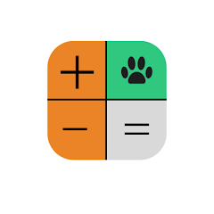
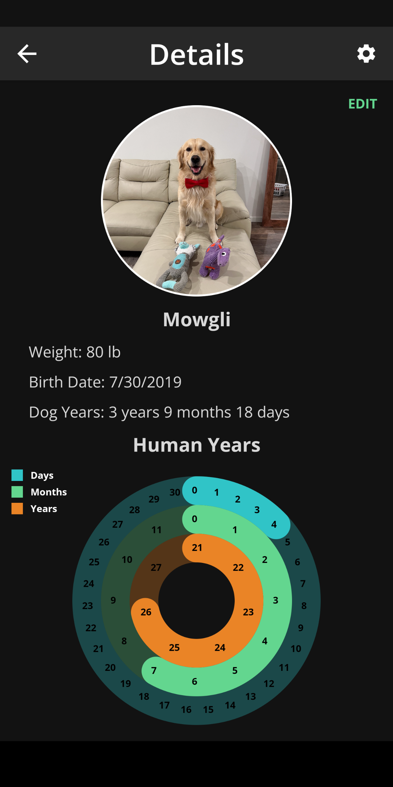
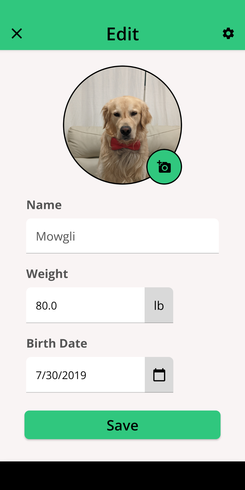
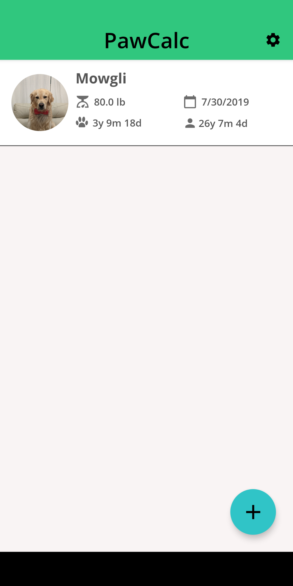
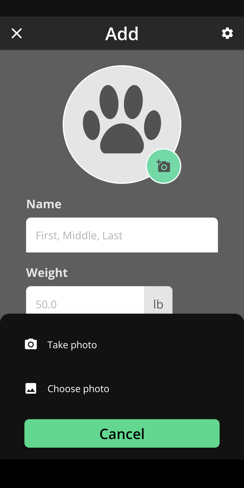
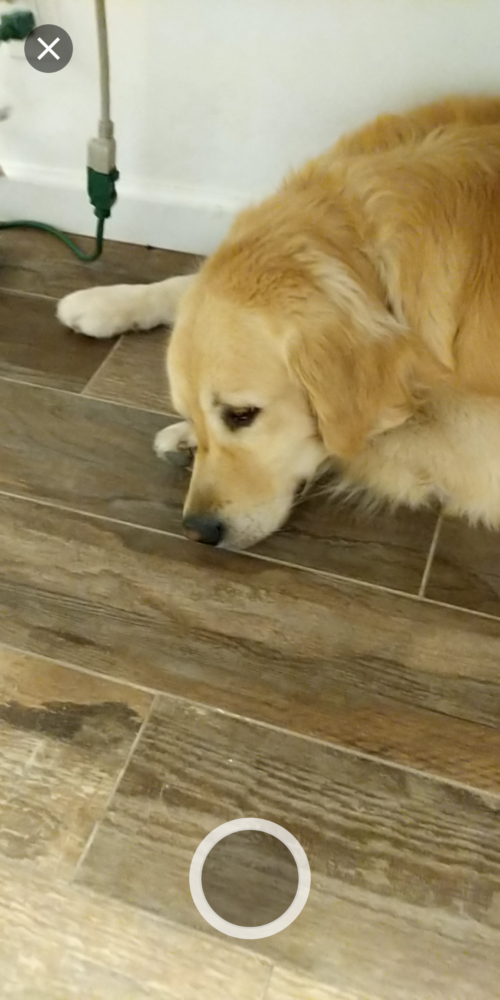

# PawCalc

PawCalc is an app that calculates how old a dog is in human years to the months and days as well.
It calculates how old a dog is by using the ratio of 1 dog year = 7 human years.

The motivation for building this app was to learn Jetpack Compose while using clean architecture and modularization. Also working on this app will allow me to keep improving my skills as an Android developer where I can use newer frameworks and technologies.

## Android Development
PawCalc is fully written in Kotlin with the UI layer written in Jetpack Compose.

The following frameworks are used:
- Dependency Injection: Dagger Hilt
- Database: Room
- Navigation: Navigation-Compose
- Concurrency: Coroutines and Flow
- Design: Material 2
- Other Jetpack libraries include: CameraX, DataStore

Future releases will include support for Landscape mode, Material 3, and eventually migrate business logic to KMM for an iOS app.

## Screenshots
     

## Demo

